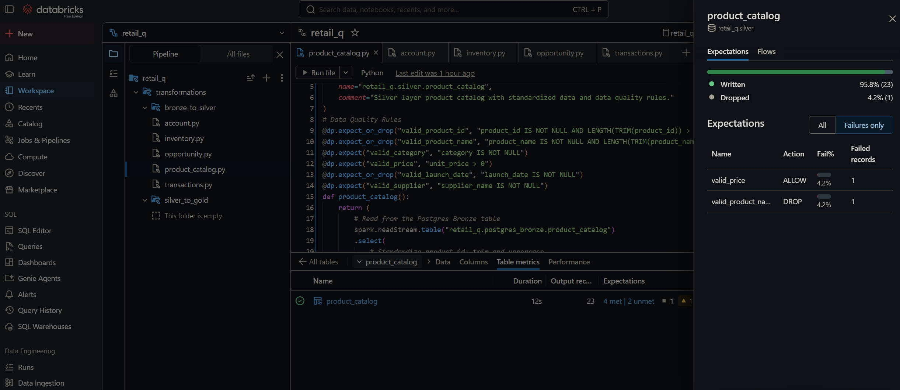

# Retail_q / Data Engineering Project

This project is an end-to-end data engineering initiative aimed at building a modern Lakehouse architecture (Medallion Architecture). The project utilizes **Databricks Delta Live Tables (DLT)** for downstream transformation and data quality enforcement.

## 🏗 Architecture Overview

The project is built on Databricks + Unity Catalog, designed with a layered architecture:

- **Source:** Data from business systems like PostgreSQL (Neon) and Salesforce.
- **Bronze (Raw):** Stores unmodified source data in Delta Lake format.
- **Silver (Cleaned):** Cleanses, normalizes, and enforces data quality rules on Bronze data using DLT.
- **Gold (Marts):** Business-level aggregated wide tables modeled as a Star Schema.

## 🔄 Hybrid Ingestion Strategy

This project employs a **hybrid ingestion strategy**, leveraging two different approaches based on the source system's capabilities:

| Source System | Ingestion Method | CDC / SCD Support | Reasoning |
| :--- | :--- | :--- | :--- |
| **PostgreSQL (Neon)** | **Lakeflow Connect** | Native SCD1 & SCD2 | Structured database with native CDC support. Managed connector simplifies pipeline maintenance. |
| **Salesforce** | **Auto Loader (CloudFiles)** | None (Manual) | CSV export lacks native CDC. Requires manual column normalization and downstream SCD handling. |
| **Blob Storage** | **Auto Loader (CloudFiles)** | None (Manual) | Flat file ingestion with schema evolution handled by Auto Loader. |

### 🔍 Comparison with Reference Architecture

The reference implementation relies solely on **Lakeflow Connect** for Salesforce ingestion. This project uses Auto Loader for Salesforce to demonstrate manual ingestion and downstream SCD handling.

| Aspect | Reference Architecture | This Project |
| :--- | :--- | :--- |
| **Salesforce Ingestion** | Lakeflow Connect (Managed) | Auto Loader (Manual CSV Export) |
| **SCD for `account`** | **SCD Type 2** (Full history) | Flat / Append-only (No history tracking) |
| **SCD for `opportunity`** | **SCD Type 1** (Overwrite) | Flat / Append-only (No history tracking) |
| **Column Availability** | Rich schema with system fields (`Id`, `IsDeleted`, etc.) | Limited to exported CSV columns |
| **Handling Missing Joins** | Native `AccountId` present in Opportunity | Manually mocked `account_name` to enable JOINs |

**Key Takeaway:**
- **Lakeflow Connect** is ideal for production-grade, low-maintenance pipelines where CDC and SCD are required out-of-the-box.
- **Auto Loader** provides maximum flexibility and control but requires manual schema management, data mocking, and downstream SCD implementation (planned via DLT `AUTO CDC`).

#### ⚠️ Critical Difference: Missing Primary Key (`Id`)

The most significant divergence between this project and the reference architecture is the **absence of the Salesforce system `Id` field**.

**Reference Architecture (Salesforce API / Lakeflow Connect):**
```python
# account.py (Author's version)
F.col("Id").alias("id"),                            # System Primary Key
F.col("MasterRecordId").alias("master_record_id"),  # System merge history

# opportunity.py (Author's version)
F.col("Id").alias("id"),                            # System Primary Key
F.col("AccountId").alias("account_id"),             # System Foreign Key linking to account
```

**This Project (CSV Export / Auto Loader):**
```python
# account.py (This project)
F.col("account_name").alias("account_name"),        # Business name used as primary key

# opportunity.py (This project)
F.col("opportunity_name").alias("opportunity_name"),
F.col("account_name").alias("account_name"),        # Manually mocked to enable JOINs
```

| Aspect | Reference Architecture | This Project |
| :--- | :--- | :--- |
| **Primary Key (`account`)** | `Id` (Salesforce System ID) | `account_name` (Business Name) |
| **Foreign Key (`opportunity`)** | `AccountId` (Salesforce System ID) | `account_name` (Mocked Business Name) |
| **Join Logic** | `acc.id = oppo.account_id` | `acc.account_name = oppo.account_name` |
| **Data Integrity** | **High** — System IDs are unique and immutable. | **Low** — Business names can be duplicated or changed. |
| **Root Cause** | Ingestion via **Lakeflow Connect** (API) preserves system fields. | Ingestion via **Auto Loader** (CSV export) omits system fields. |

**Why This Matters:**
- **Referential Integrity Risk:** Joining on `account_name` is functionally correct for this test dataset, but it is **not production-ready**. In real-world scenarios, two different accounts could share the same name (e.g., "Acme Corp"), leading to incorrect JOIN results (data fan-out).
- **The "Mocking" Workaround:** To enable downstream JOINs, this project manually injected `account_name` into the `opportunity` table via PySpark code. This simulates the Salesforce UI behavior but does not replace the need for a true system ID.
- **Future Improvement:** To achieve production-grade referential integrity, the ingestion pipeline should be migrated to **Lakeflow Connect** or the CSV export should be configured to include the `AccountId` field.

## 📁 Project Structure

### Storage Structure (Bronze Layer)
```text
retail_q (Unity Catalog)
├── postgres_bronze (Schema from Lakeflow Connect)
│   ├── inventory
│   └── product_catalog
└── bronze (Schema from Auto Loader)
    └── source (Volume)  <-- Underlying storage structure
        ├── raw_data/                 <-- Business source data (CSV files)
        │   ├── blob_transactions/
        │   ├── salesforce_acc/
        │   └── salesforce_oppo/
        ├── _schemas/                 <-- Auto Loader schema inference records (System files)
        │   ├── blob_transactions/
        │   ├── salesforce_acc/
        │   └── salesforce_oppo/
        └── _checkpoints/             <-- Auto Loader incremental load checkpoints (System files)
            ├── blob_transactions/
            ├── salesforce_acc/
            └── salesforce_oppo/
```

### DLT Pipeline Structure (Silver Layer)
```text
retail_q.silver
├── account.py            <-- Salesforce Account cleaning
├── inventory.py          <-- PostgreSQL Inventory cleaning
├── opportunity.py        <-- Salesforce Opportunity cleaning
├── product_catalog.py    <-- PostgreSQL Product Catalog cleaning
└── transactions.py       <-- Blob Transactions cleaning & type casting
```

## 🚀 Data Ingestion Strategies

### 1. PostgreSQL Ingestion (Lakeflow Connect)
- **Goal:** Sync data from PostgreSQL (e.g., `inventory`, `product_catalog`) into the Bronze layer.
- **Approach:** Databricks **Lakeflow Connect**.
- **SCD Handling:** Lakeflow Connect natively supports **SCD Type 1 (overwrite)** and **SCD Type 2 (historical tracking)**. This significantly simplifies CDC pipelines without writing complex `MERGE` logic manually. For `product_catalog`, the system-generated CDC columns (`__START_AT`, `__END_AT`) are preserved and used to derive `is_active` in the Silver layer.

### 2. Salesforce & Blob Ingestion (Auto Loader)
*Completed!*
Utilizing Databricks **Auto Loader (CloudFiles)** combined with PySpark streaming to incrementally load CSV files from Unity Catalog Volumes into Delta tables.

**Key Implementation Details & Code Snippet:**
- **Incremental Loading:** Configured independent `checkpointLocation` and `schemaLocation` for each stream.
- **Column Name Normalization:** Delta Lake rejects column names with spaces or special characters. Regex is used to clean names upon ingestion.
- **Data Mocking:** Missing relational fields (e.g., `account_name`) are populated via code to ensure downstream joining logic.

#### A. Column Name Normalization & Incremental Load
```python
import re

# 1. Define Auto Loader stream
df_acc = (spark.readStream
  .format("cloudFiles")
  .option("cloudFiles.format", "csv")
  .option("header", "true")
  .option("cloudFiles.schemaLocation", "dbfs:/Volumes/retail_q/bronze/source/_schemas/salesforce_acc")
  .load("dbfs:/Volumes/retail_q/bronze/source/raw_data/salesforce_acc/") 
)

# 2. Clean column names (handling spaces, slashes, etc.)
for col_name in df_acc.columns:
    clean_name = re.sub(r'[ /-]', '_', col_name).lower()
    clean_name = re.sub(r'_+', '_', clean_name).strip('_')
    df_acc = df_acc.withColumnRenamed(col_name, clean_name)

# 3. Write to Bronze Table with Checkpoint
(df_acc.writeStream
  .option("checkpointLocation", "dbfs:/Volumes/retail_q/bronze/source/_checkpoints/salesforce_acc")
  .trigger(availableNow=True) 
  .toTable("retail_q.bronze.salesforce_acc")
)
```

#### B. Data Mocking: Injecting Missing `account_name`
Since the source Opportunity CSV lacks relational keys, we simulate the Salesforce UI behavior by assigning specific `account_name` values based on row numbers to enable downstream JOINs.

```python
from pyspark.sql.functions import col, when, monotonically_increasing_id, row_number
from pyspark.sql.window import Window

# 1. Read the existing Bronze table
df_oppo = spark.read.table("retail_q.bronze.salesforce_oppo")

# 2. Generate row numbers to mimic Salesforce UI selection
windowSpec = Window.orderBy(monotonically_increasing_id())
df_with_row = df_oppo.withColumn("row_num", row_number().over(windowSpec))

# 3. Assign account_name based on specific row ranges (mocking the UI batch update)
df_oppo_mocked = df_with_row.withColumn(
    "account_name",
    when((col("row_num") >= 3) & (col("row_num") <= 7), "Fresh Stores Pvt Ltd 4")   
    .when((col("row_num") >= 27) & (col("row_num") <= 31), "Global Traders Pvt Ltd 5") 
    .otherwise("Elite Wholesale Pvt Ltd 19")  
).drop("row_num")

# 4. Overwrite the Bronze table with the new mocked column
# Note: mergeSchema is enabled to allow adding new columns to the existing Delta table
(df_oppo_mocked.write
 .mode("overwrite")
 .option("mergeSchema", "true") 
 .saveAsTable("retail_q.bronze.salesforce_oppo")
)
```

## 🥈 Silver Layer: Transformation (Delta Live Tables)

All Silver transformations are implemented in **DLT (Python)**. The pipeline reads from Bronze tables (`spark.readStream`) and applies:

1. **Column Standardization:** Trimming, upper-casing (`F.upper`, `F.trim`), and title-casing (`F.initcap`) for consistency.
2. **Type Casting:** Converting string columns to proper numeric types (e.g., `amount` -> double, `quantity` -> int).
3. **Business Logic Enrichment:**
   - Deriving `inventory_status` (`LOW_STOCK` / `HEALTHY`).
   - Deriving `deal_size` (`ENTERPRISE` / `MID_MARKET` / `SMALL`).
   - Deriving `product_segment` (`PREMIUM` / `MID_RANGE` / `BUDGET`).
   - Deriving `gross_amount` in transactions.
   - Parsing non-standard timestamps (`dd-MMM-yyyy hh.mm.ss a`).

### Data Quality Expectations

Data quality is enforced at the Silver layer using DLT Expectations. This ensures only reliable data reaches downstream consumers.

#### `account.py`
- **Drop:** `non-null account_name` (Ensures every account has a name as the primary identifier).
- **Warn:** `valid type` (Validates that the account type belongs to a predefined set).

#### `inventory.py`
- **Drop:** `non-null inventory_id`, `non-null product_id`, `non-null store_id` (Primary/foreign keys must exist).
- **Warn:** `valid stock_quantity` (Flags records where `stock_quantity <= 0`).

#### `opportunity.py`
- **Drop:** `non-null opportunity_name` (Primary key must exist).
- **Warn:** `valid amount` (Flags negative amounts).
- **Warn:** `valid stage` (Ensures the stage matches the expected sales pipeline stages).

#### `product_catalog.py`
- **Drop:** `valid_product_id`, `valid_product_name`, `valid_launch_date` (Non-null and non-empty core fields).
- **Warn:** `valid_category`, `valid_price`, `valid_supplier` (Business logic checks).

#### `transactions.py`
- **Drop:** `non-null transaction_id`, `non-null product_id` (Keys must exist).
- **Warn:** `valid quantity`, `valid selling_price`, `valid discount_amount`, `valid payment_mode` (Validates numeric ranges and allowed categorical values).

**Execution Order & Validation Logic:**

The `@dp.expect` rules are applied **after** all transformation logic (`select`, `cast`, `when/otherwise`) is executed, but **before** the data is written to the Silver tables.

This means:
- **Not** testing the raw Bronze data (which may contain strings or unvalidated values).
- **Not** testing the already-materialized Silver table.
- **Testing the in-flight, transformed DataFrame** — the exact output of the `return` statement.

**If the pipeline runs successfully:**
- Data has passed all `@dp.expect` checks (or been dropped by `@dp.expect_or_drop`).
- The resulting Silver table contains only records that satisfy the defined data quality rules.
- Any records failing `@dp.expect` (not `_or_drop`) are still written to the table but flagged in the pipeline metrics.

#### DLT vs. dbt: Data Quality Validation Timing

A key architectural difference between this project (using DLT) and a traditional dbt-based approach is **when** data quality rules are executed.

| Aspect | dbt (Test After Materialization) | DLT (Validate Before Write) |
| :--- | :--- | :--- |
| **Execution Timing** | Runs **after** the model is materialized (table/view is already created). | Runs **before** the data is written to the target table. |
| **Mechanism** | SQL-based tests (e.g., `not_null`, `unique`, custom SQL) query the built table. | Python decorators (`@dp.expect`, `@dp.expect_or_drop`) validate the in-flight DataFrame. |
| **Handling Failures** | Raises an error or warning **after** the table has been populated. | Drops the record (`_or_drop`) or flags it (`expect`) **before** it reaches the table. |
| **Impact on Downstream** | Downstream consumers might briefly see bad data if tests fail after the run. | Downstream consumers **never** see dropped records; they only see validated data. |
| **Cost** | Requires a separate query execution against the materialized table. | Piggybacks on the existing transformation execution (more efficient). |

**Why This Matters:**
- **dbt** is a "post-mortem" check: "Did we build a bad table? Let's find out and alert."
- **DLT** is a "gatekeeper" check: "Should this record even enter the table? If not, drop it now."

This project adopts the **DLT** approach to ensure the Silver layer is always clean and trustworthy from the moment data lands.

### 📊 Data Quality in Action (Real Metrics)

The following screenshot captures the actual data quality metrics from the Silver layer pipeline run:



**Observations from the pipeline run:**
- **Written:** 95.8% (23 records) — Clean records successfully written to the Silver table.
- **Dropped:** 4.2% (1 record) — A record with a missing `product_name` was dropped by `@dp.expect_or_drop`.
- **`valid_price` (ALLOW):** 4.2% failure rate. A record with a negative `unit_price` was **allowed** to enter the table (but flagged), demonstrating the difference between `@dp.expect` (Warn/Allow) and `@dp.expect_or_drop` (Drop).
- **`valid_product_name` (DROP):** 4.2% failure rate. A record with an empty `product_name` was **dropped**, ensuring downstream consumers never see nameless products.

This real-world example proves the importance of **rule-level granularity**: if we had used a single `@dp.expect_all_or_drop` block, we would not be able to distinguish which specific rule triggered the drop. This confirms why granular `expect` rules are preferred in production-grade pipelines.

### Data Quality Strategy: Drop vs. Quarantine

A critical design decision in the Silver layer is how to handle records that fail data quality expectations.

**Option 1: `@dp.expect_or_drop` (Hard Drop)**
- **Behavior:** Invalid records are permanently discarded before writing to the Silver table.
- **Pros:** The Silver table is guaranteed to be 100% clean.
- **Cons:** The dropped records are "lost forever" with no trace for debugging.
- **Use Case:** Core master data where a missing key renders the record completely useless (e.g., missing `product_id`).

**Option 2: Quarantine Table (Soft Drop)**
- **Behavior:** Invalid records are filtered into a separate `_quarantine` table instead of being discarded.
- **Pros:** 
  - The main Silver table remains clean for downstream consumers.
  - Bad records are preserved for auditing, debugging, and potential re-processing.
- **Cons:** Requires maintaining an additional DLT table.
- **Use Case:** Business-critical data where you want to investigate upstream issues without blocking the pipeline.

**Implementation Example: Quarantine for Missing Product Names**

```python
# Main Silver Table: Only clean records (using expect_or_drop)
@dp.table(name="retail_q.silver.product_catalog")
@dp.expect_or_drop("valid_product_name", "product_name IS NOT NULL AND LENGTH(TRIM(product_name)) > 0")
def product_catalog():
    return spark.readStream.table("retail_q.postgres_bronze.product_catalog")...

# Quarantine Table: Only invalid records (manually filtered)
@dp.table(name="retail_q.silver.product_catalog_quarantine")
def product_catalog_quarantine():
    return spark.readStream.table("retail_q.postgres_bronze.product_catalog") \
        .filter(F.col("product_name").isNull() | (F.length(F.trim(F.col("product_name"))) == 0))
```

**Why This Matters:**
- **Data Observability:** You can always answer the question "What happened to the dropped records?"
- **Pipeline Resilience:** A single bad record does not block the entire pipeline, but it is also not silently ignored.
- **Upstream Accountability:** Quarantine tables provide concrete evidence to share with upstream teams for root-cause analysis.

## 🛠 Development Workflow: Preview Before DLT

To ensure transformation logic is correct before deploying to the DLT pipeline, a **batch preview** approach is strictly followed. This avoids wasting cluster resources and time on iterative DLT runs.

**Standard Procedure:**
1. Write the transformation logic using `spark.read.table(...)` (Batch mode) in a standard Databricks Notebook.
2. Preview the output using `display()` to validate data quality, type casting, and business logic.
3. Once the logic is verified, change `spark.read` to `spark.readStream` and encapsulate the code inside the `@dp.table` decorator for the DLT pipeline.

**Example: Previewing Transactions Transformation**
```python
from pyspark.sql import functions as F

# 1. Use standard batch read instead of readStream for previewing
source_df = spark.read.table("retail_q.bronze.blob_transactions")

# 2. Apply the exact transformation logic intended for the DLT pipeline
preview_df = source_df.select(
    F.col("transaction_id"),
    F.col("opportunity_name"),
    F.col("product_id"),
    F.col("store_id"),
    F.col("quantity").cast("int").alias("quantity"),
    F.col("selling_price").cast("double").alias("selling_price"),
    (F.col("quantity").cast("int") * F.col("selling_price").cast("double")).alias("gross_amount"),
    F.col("discount_amount").cast("double").alias("discount_amount"),
    F.to_timestamp(F.col("transaction_timestamp"), "dd-MMM-yyyy hh.mm.ss a").alias("transaction_timestamp"),
    F.col("payment_mode"),
    F.col("sales_channel")
)

# 3. Display the result to verify the output
display(preview_df.limit(10))
```
## 🥇 Gold Layer: Star Schema (Delta Live Tables)

The Gold layer is modeled as a **Star Schema**, providing business-ready data for BI tools and analytical queries. It consists of **one fact table** and **three dimension tables**.

### Star Schema Design

| Table | Type | Source (Silver Layer) | Description |
| :--- | :--- | :--- | :--- |
| `fact_sales` | Fact | `transactions` + `opportunity` | Transaction-level sales records with customer, product, and date keys. |
| `dim_customer` | Dimension | `account` | Customer attributes (name, type, location, industry). |
| `dim_product` | Dimension | `product_catalog` | Product attributes (name, category, brand, segment, price). |
| `dim_calendar` | Dimension | Programmatically generated | Date attributes (year, quarter, month, week, day, is_weekend). |

### Key Design Decisions

1. **Surrogate Keys for Missing System IDs:**
   - Since the Salesforce CSV export lacks the `Id` field, `account_name` is used as the `customer_id` (foreign key) in both `fact_sales` and `dim_customer`. This enables JOINs without a native system ID.

2. **Generated Calendar Dimension:**
   - `dim_calendar` is not ingested from any source system. It is generated programmatically using Spark SQL's `sequence()` function, covering the date range **2020-01-01 to 2030-12-31**.
   - A `date_key` (integer in `yyyyMMdd` format) is derived for efficient JOINs with the fact table.

3. **Materialized Views vs. Streaming Tables:**
   - Gold layer objects are defined as `MATERIALIZED VIEW` (SQL) or `@dp.table` (Python), allowing DLT to manage refresh schedules automatically.

### Example: Querying the Star Schema

The following SQL demonstrates how the fact table JOINs with all three dimensions to produce a business-ready view:

```sql
SELECT 
    f.transaction_id,
    f.transaction_date,
    c.customer_name,
    c.billing_city,
    p.product_name,
    p.category,
    cal.day_of_week_name,
    f.quantity,
    f.gross_amount
FROM retail_q.gold.fact_sales f
LEFT JOIN retail_q.gold.dim_customer c 
    ON f.customer_id = c.customer_id
LEFT JOIN retail_q.gold.dim_product p 
    ON f.product_id = p.product_id
LEFT JOIN retail_q.gold.dim_calendar cal 
    ON f.transaction_date = cal.full_date;
```

### Pipeline Lineage

The Gold layer completes the **Bronze → Silver → Gold** pipeline. The DLT pipeline graph should show the following dependencies:

```text
Bronze (Raw)                        Silver (Cleaned)                   Gold (Business-Ready)
─────────────────                   ─────────────────                  ────────────────────────
salesforce_acc              ──►     silver.account              ──►    gold.dim_customer
product_catalog (PG)        ──►     silver.product_catalog      ──►    gold.dim_product
                                    
blob_transactions           ──►     silver.transactions         ──┐
salesforce_oppo             ──►     silver.opportunity          ──┴─►  gold.fact_sales
                                    
(generated)                 ──►     ─────────────────────────   ──►    gold.dim_calendar
```

太好了，恭喜你准备给这个项目画上完美的句号！

这句话最适合放在 **`## 🥇 Gold Layer: Star Schema`** 这一章的 **`### Pipeline Lineage`** 之后，也就是 **`### Semantic Layer: Metric View (Optional)`** 之前。

因为这是对你 Gold 层数据准确性的最终验证，逻辑上属于“物理模型建好后，数据对账”的收尾环节。

### 具体操作：
在你的 README 里找到这一部分：

```markdown
### Pipeline Lineage

The Gold layer completes the **Bronze → Silver → Gold** pipeline. The DLT pipeline graph should show the following dependencies:

```text
Bronze (Raw)                        Silver (Cleaned)                   Gold (Business-Ready)
─────────────────                   ─────────────────                  ────────────────────────
salesforce_acc              ──►     silver.account              ──►    gold.dim_customer
product_catalog (PG)        ──►     silver.product_catalog      ──►    gold.dim_product
                                    
blob_transactions           ──►     silver.transactions         ──┐
salesforce_oppo             ──►     silver.opportunity          ──┴─►  gold.fact_sales
                                    
(generated)                 ──►     ─────────────────────────   ──►    gold.dim_calendar
```

### Data Reconciliation

To validate the pipeline's end-to-end data integrity, raw CSV files were independently summed using Excel:
- `05_blob_transactions_history.csv` (1000 rows): **175,905,308**
- `06_blob_transactions_incremental_100.csv` (100 rows): **18,188,552**

**Total (Excel):** `175,905,308 + 18,188,552 = 194,093,860`

This exactly matches the `SUM(gross_amount)` from the Gold layer `fact_sales` table:

```sql
SELECT SUM(gross_amount) FROM retail_q.gold.fact_sales;
-- Result: 194,093,860
```

**Conclusion:** The pipeline accurately ingests, transforms, and aggregates every row of source data without loss or duplication, confirming end-to-end data integrity.

### Semantic Layer: Metric View (Optional)

To demonstrate how the Gold layer can be extended into a governed semantic layer, a minimal **Metric View** is defined on top of `fact_sales`.

```sql
%sql
CREATE VIEW retail_q.retail_semantic.retail_metrics
WITH METRICS
LANGUAGE YAML
AS $$
version: 1.1
source: retail_q.gold.fact_sales
comment: Retail metrics for analyzing sales transactions
dimensions:
  - name: Payment Mode
    expr: payment_mode
  - name: Sales Channel
    expr: sales_channel
  - name: Deal Size
    expr: deal_size
  - name: Stage
    expr: stage
measures:
  - name: Total Revenue
    expr: SUM(gross_amount)
  - name: Transaction Count
    expr: COUNT(1)
  - name: Total Quantity Sold
    expr: SUM(quantity)
  - name: Average Deal Amount
    expr: AVG(amount)
$$
```

**Note:** This Metric View is a minimal working example. It defines 4 dimensions and 4 measures directly on `fact_sales`, without the enterprise-grade formatting (synonyms, currency format, etc.) shown in the reference architecture. It exists to demonstrate the concept of a semantic layer, not to replace a full BI governance implementation.

## ⚠️ Lessons Learned

1. **Delta Lake Column Name Restrictions:**
   - `Delta Lake` by default rejects column names containing spaces, `/`, or other illegal characters.
   - **Solution:** Immediately clean and rename columns after reading the stream in Auto Loader.

2. **Auto Loader vs. SCD:**
   - Auto Loader only performs **"faithful ingestion"**; it allows duplicate IDs to enter the Bronze layer by default.
   - **SCD logic is not handled here.** It should be processed in the Silver layer using **DLT's `AUTO CDC`** or `MERGE INTO`.

3. **Volume File Movement:**
   - Moving files in Unity Catalog Volumes is strict; `mv` often fails due to hidden placeholder files.
   - **Solution:** Use `dbutils.fs.mv` or a combination of `cp -r` and `rm -rf`.

4. **Timestamp Parsing in DLT:**
   - Before applying `F.to_timestamp`, always preview the actual string format using a batch `spark.read` to avoid `NULL` propagation.

5. **Metric View Concepts & `MEASURE()` Function:**
   - **`name`** = Business-friendly alias (e.g., `"Payment Mode"`).
   - **`expr`** = Physical column or aggregation logic (e.g., `payment_mode` or `SUM(gross_amount)`).
   - **Benefit:** Decouples business terminology from physical schema, enabling schema evolution without breaking downstream BI reports.
   - **Usage Note:** Querying a Metric View requires explicit handling of dimensions and measures:
     ```sql
     -- Dimensions can be selected directly
     -- Measures must be wrapped in MEASURE() to trigger the aggregation
     SELECT 
         `Payment Mode`,
         MEASURE(`Total Revenue`) AS total_revenue,
         MEASURE(`Transaction Count`) AS transaction_count
     FROM retail_q.retail_semantic.retail_metrics
     GROUP BY ALL;
     ```
   - **Why:** Metric Views are designed for BI tools and AI assistants that handle this automatically. Manual SQL queries must use `MEASURE()` to trigger the aggregation.

## 🎯 Key Architecture Decisions

This project is built on several intentional architectural choices. The following decisions are documented to explain **why** certain approaches were taken over alternatives.

| Decision | Chosen Approach | Rationale |
| :--- | :--- | :--- |
| **Transformation Framework** | **DLT (Delta Live Tables)** over dbt | Built-in data quality expectations, streaming-native, and native `AUTO CDC` support without an external orchestration layer. |
| **PostgreSQL Ingestion** | **Lakeflow Connect** | Native CDC with out-of-the-box SCD1/SCD2 support, eliminating manual MERGE logic. |
| **Salesforce/Blob Ingestion** | **Auto Loader (CloudFiles) with CSV export** | Manually exported CSV files were used instead of a managed connector. Auto Loader handles schema evolution and incremental loading with independent checkpoints. |
| **SCD Type 2 Handling** | **Lakeflow Connect native CDC** (`__START_AT` / `__END_AT`) for PostgreSQL; **Flat / Append-only** for Salesforce | Salesforce CSV exports do not contain CDC metadata. SCD2 is only supported natively for PostgreSQL via Lakeflow Connect. |
| **Data Quality Strategy** | **Granular `@dp.expect` rules** over `@dp.expect_all_or_drop` | Per-rule audit metrics for precise root-cause analysis; avoids "black box" drops. |
| **Missing Salesforce System IDs** | **Business name (`account_name`) as surrogate key** | The Salesforce CSV export lacks the `Id` field. `account_name` is used as a surrogate key to enable JOINs between `account` and `opportunity`. |
| **Gold Layer Modeling** | **Star Schema** with generated calendar dimension | Industry-standard dimensional modeling for BI performance and usability. |
| **Semantic Layer / Metric View** | **Not implemented; concept documented** | The reference architecture defines a Metric View (`retail_metrics`) with 6 measures (Transaction Count, Total Revenue, etc.) and 15 dimensions for BI consumption. This project does not implement it because there is no downstream BI team. However, the Star Schema is fully compatible with a future Metric View layer. |

**Key Takeaway:**
- Every decision in this project was made with **observability**, **maintainability**, and **production-readiness** in mind.
- Trade-offs (e.g., using `account_name` instead of `Id`) are explicitly documented rather than hidden.
- **Note:** The reference architecture (see below) uses Lakeflow Connect for Salesforce, which provides native SCD2 and system fields. This project intentionally uses Auto Loader with CSV export to demonstrate manual ingestion handling.

---

## 📚 Reference Architecture

The reference implementation for this project is based on the following tutorial:

- **YouTube:** [Retail Data Engineering Project in Databricks](https://www.youtube.com/watch?v=QHwszePV3GY&list=PLShYG8gCK1IU&index=2&t=4629s)